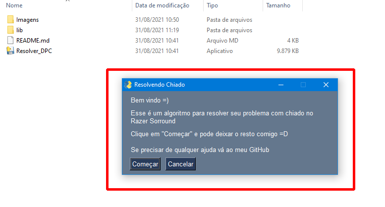
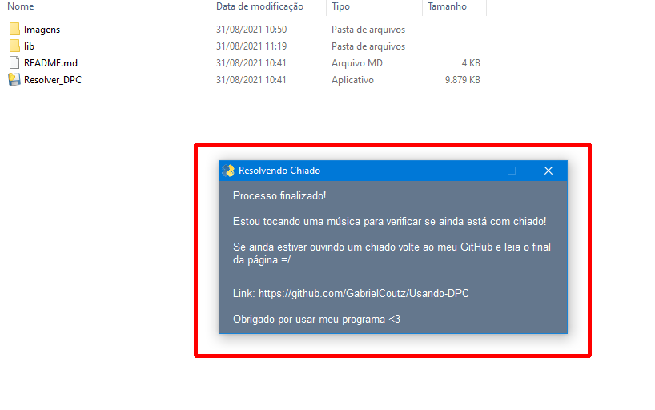

# **AVISO IMPORTANTE**

# **!!!**

<h2>

ATUALIZAÇÃO 30/08

Estou fazendo alguns teste para deixar os arquivos mais leves e assim, fazendo os downloads serem mais rápidos.

   Se ocorrer algum erro por favor <a href='#Contato'>**ME AVISE AQUI**</a>, pois, como mencionei, são TESTES!!!

   Alguns passos abaixo podem estar sendo inúteis devido à essas alterações, portanto, caso algum passo não esteja de acordo pode pulá-lo.
</h2>

# **!!!**

<h1>Como Utilizar?</h1>

1. Clique **[AQUI](https://github.com/GabrielCoutz/Usando-DPC/archive/refs/heads/main.zip)** para baixar

2. Crie uma pasta na **Área de Trabalho** e extraia o arquivo dentro

3. Dentro da pasta **(Usando-DPC-main)** clique com o botão direito em **Resolver_DPC**, depois em **Propriedades**

4. Vá em **Compatibilidade** e marque a opção **Executar esse programa como administrador**, clique em **OK**

5. Após isso, execute normalmente **Resolver_DPC**

6. Aparecerá uma janela inicial, leia com atenção e clique em **Começar**

7. Após isso o programa começará a rodar, apenas espere terminar ;)

8. A janela final aparecerá, só ler e fechar

<h1>Pós execução</h1>

Agora, para que esse programa rode e resolva o problema sempre que o pc é ligado, precisamos adicioná-lo à pasta Inicializar do Windows.

1. Mova a pasta para onde deseja guardá-la, pode ser em qualquer lugar, contanto que não seja apagada!

2. Pressione **Windows** + **R** e digite **%appdata%**, depois clique em OK

3. Siga esse caminho: **_AppData --> Roaming --> Microsoft  --> Windows --> Menu Iniciar --> Programas --> Inicializar_**
   1. Com vc pode estar em inglês, então as 3 últimas pastas serão **_--> Start Menu --> Programs --> Startup_**

4. Volte à pasta dos arquivos **(Usando-DPC-main)**. Clique com o botão direito em **Resolver_DPC** e clique em **Criar Atalho**

5. Agora basta colocar esse atalho dentro da pasta _Inicializar_ para que rode quando o windows iniciar

6. Para finalizar, reinicie o pc e veja a mágica acontecer kkk

<h1 id='Contato'>Entre em Contato Comigo ^-^</h1>
Caso precise falar comigo ou tenha acontecido algum erro, só fazer isso:

Clique em **Issues** e depois em **New Issue**. Descreva seu problema, se possível com imagens, e espere meu contato =)

