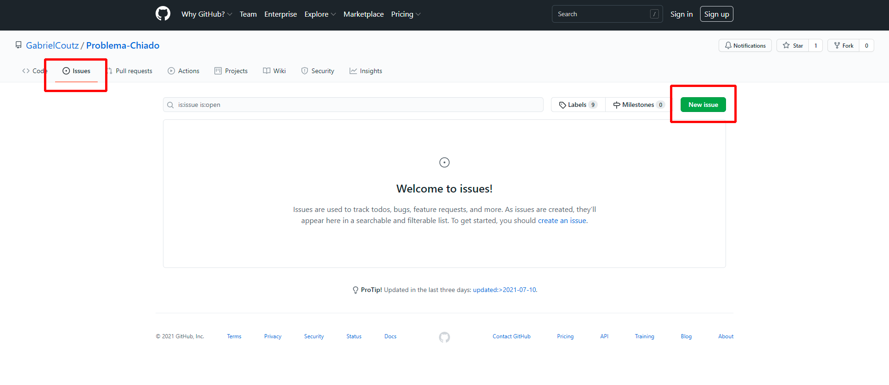

<h1>Como Utilizar?</h1>

1. Baixe o **DPC Latency** **[aqui](https://www.softpedia.com/get/System/System-Info/DPC-Latency-Checker.shtml)** _(não é necessário executar, apenas baixe)_

2. Clique em **FREE DOWNLOAD**

3. Depois clique em **Softpedia Secure Download (US)** e aguarde o download iniciar

4. Após o download terminar, vá até onde está a sua pasta de download, clique com o **Botão Direito** em **dpclat** e depois vá em **Propriedades**

5. Marque a opção **Desbloquear** e depois clique em **OK**

> _Caso não tenha feito isso, toda vez que o programa executar aparecerá uma janela de confirmação do Windows, isso é bem chato, então para não incomodar só desbloqueie_

6. Entre **[aqui](https://github.com/GabrielCoutz/Usando-DPC)**, clique em **Code** e depois em **Download ZIP**

7. Crie uma pasta na **Área de Trabalho** e extraia o arquivo dentro, pode colocar qualquer nome nessa pasta

8. Abra a pasta que foi extraída **(Usando-DPC-main)** e clique com o botão direito em **Resolver_DPC**, depois em **Propriedades**

9. Vá em **Compatibilidade** e marque a opção **Executar esse programa como administrador**, clique em **OK**

10. Após isso, execute **Resolver_DPC**

11. Aparecerá uma janela inicial, leia com atenção e clique em **Começar**

12. Após isso o programa começará a rodar, então aproveite a música de espera _( selecionada com carinho XD )_ e aguarde terminar ;)

13. A janela final aparecerá, só ler e fechar

<h1>Pós execução</h1>

Agora, para que esse programa rode e resolva o problema sempre que o pc é ligado, precisamos adicioná-lo à pasta Inicializar do Windows.

1. Pressione **Windows** + **R** e digite **%appdata%**, depois clique em OK

2. Siga esse caminho: **_AppData --> Roaming --> Microsoft  --> Windows  --> Start Menu  --> Programs  --> Startup_**
   1. Com vc pode estar em português, então as 3 últimas pastas serão **_Menu Iniciar --> Programas --> Inicializar_**

3. Volte à pasta em que vc extraiu os arquivos. Clique com o botão direito em **Resolver_DPC** e clique em **Criar Atalho**

4. Agora basta colocar esse atalho dentro da pasta _Inicializar_ para que rode quando o windows iniciar

5. Para finalizar, pode colocar a pasta com todos os arquivos em qualquer lugar _(não apague)_, depois disso reinicie o pc e veja a mágica acontecer kkk

<h1>Entre em Contato Comigo ^-^</h1>
Caso precise falar comigo ou tenha acontecido algum erro, só fazer isso:

Clique em **Issues** e depois em **New Issue**. Descreva seu problema, se possível com imagens, e espere meu contato =)

